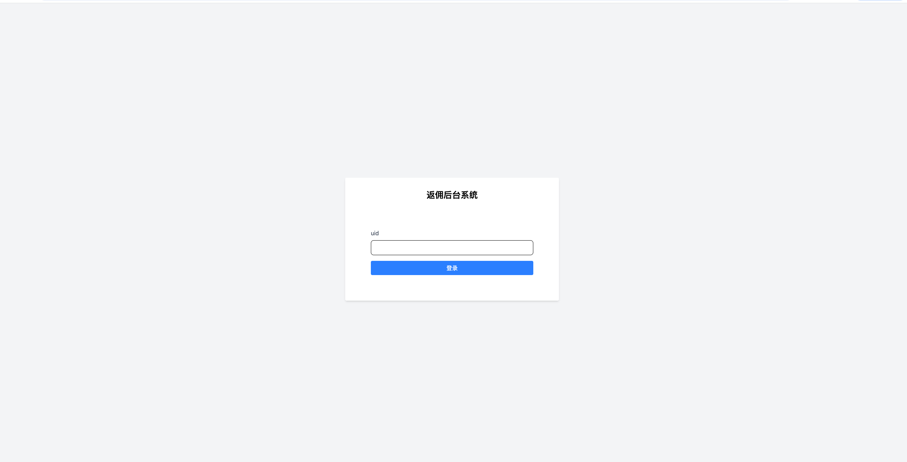
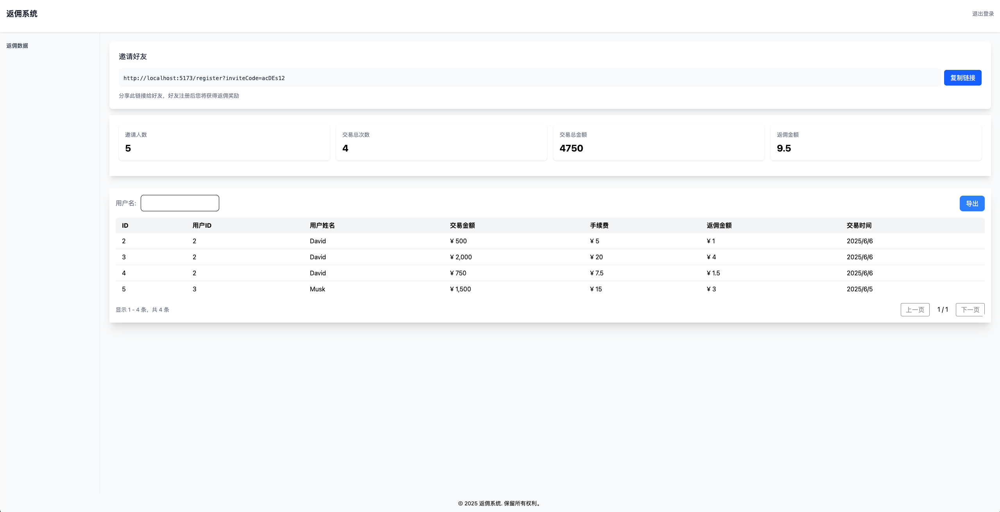
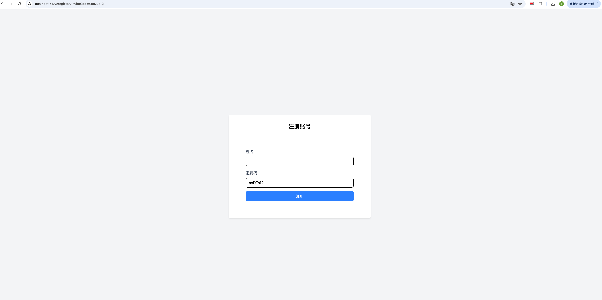

# Rebate 返利系统




## 项目概述
这是一个返利管理系统，包括登录，返佣数据，邀请注册

## 功能特性

- 登录
- 返佣数据
  - 邀请链接
  - 总览
  - 返佣明细（支持名字搜索、导出）
- 邀请注册

## 安装与运行
1. 克隆项目到本地：
   ```bash
   git clone ## 安装与运行 
   ```
2. 安装依赖：
   ```bash
   npm install -ws
   ```
3. 运行项目：
   ```bash
   npm run start ## 会同时启动前端和后端
   ```

## 技术栈

### 前端
- React 19
- TypeScript
- Tailwind CSS
- Vite

### 后端
- Node.js
- Express

## 项目结构

### 前端

- src/
  - components/
    - 公用组件，包括 `Header`, `Footer`, `SideNav`, `Form`, `Table`, `Pagination`
  - pages/ 
    - 页面组件，包括 `Login`, `Dashboard`, `Register`
    - components/
      - 页面内的组件
  - contexts/
    - 主要是 `AuthContext`，用于用户信息的管理
  - interfaces/
    - 接口定义, 例如数据模型 `IUser`(用户), `ITradeItem`(交易数据)，Form 表单的定义, Table 表格的定义
  - layout/
    - 页面布局，控制登录后主要页面的布局
  - routes/
    - 路由配置
  - utils/
    - 工具函数，包括并发请求，导出表格数据，格式化日期，`Suspense` 的封装函数
  - App.tsx
  - main.tsx
  
### 前端实现方案
- 抽象数据结构，例如 `FormFeild` 的定义，能快速实现表单的渲染以及后续添加规则（低代码思路）
- 组件化，例如 `Table` `Form` 等组件，抽象页面基本结构
- 使用 Context 管理用户信息，方便全局使用
- 使用了 `Suspense`, `useDeferredValue` 等 React 新特性, 实现了异步数据的加载以及高效响应
- 代码尽可能抽象共用，减少重复代码，提高可维护性
- api 接口抽象了 get 和 post 方法，用于管理接口，例如登录失效等
- 使用了最新的 React 19, 避免了 `useMemo`, `useCallback` 等旧时性能调优的方式，减少心智负担
- 导出支持并发请求（可配置最大并发数），客户端导出


### 后端
- src/
  - auth
    - 用户认证相关,设置 session 的基本数据结构
  - database
    - 数据库相关，但目前使用文件json的存储方式
  - middlewares
    - 中间件, 例如 `authMiddleware` 用于验证用户是否登录, `errorHandler` 用于处理错误
  - routes
    - 路由配置, 具体的路由响应代码在这里
  - utils
    - 工具函数, 例如文件读写等方法

### 后端实现方案
- 采用了一定的模块化设计，便于扩展和维护
- 采用了中间件的方式来自定义实现登录校验
- 临时使用文件存储来替换数据库，可直接运行项目（数据存储在 `data` 文件夹下）